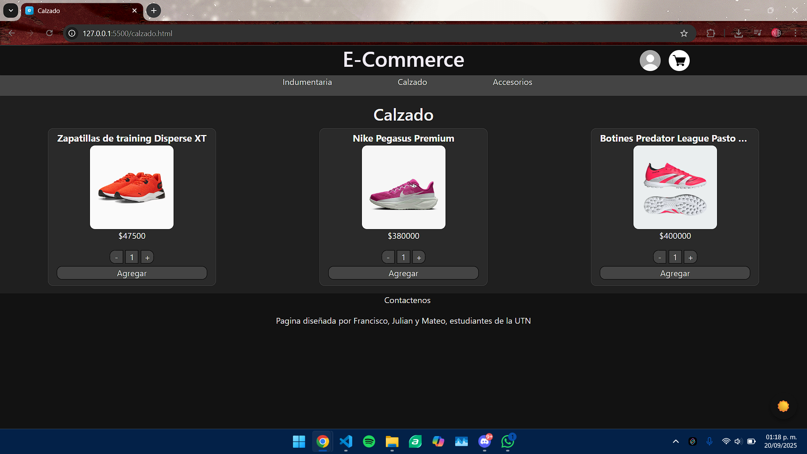
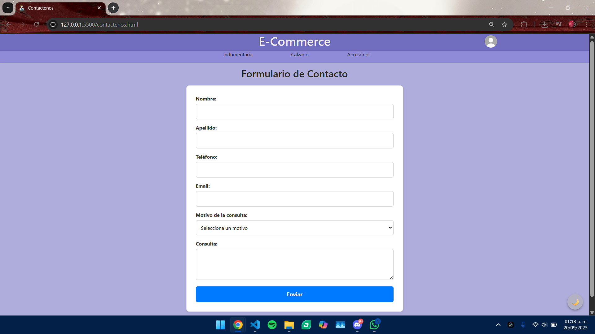
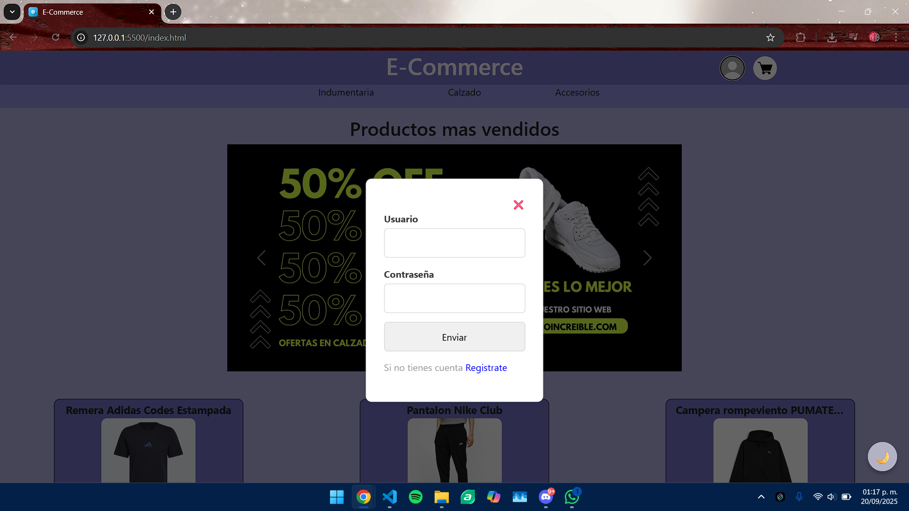
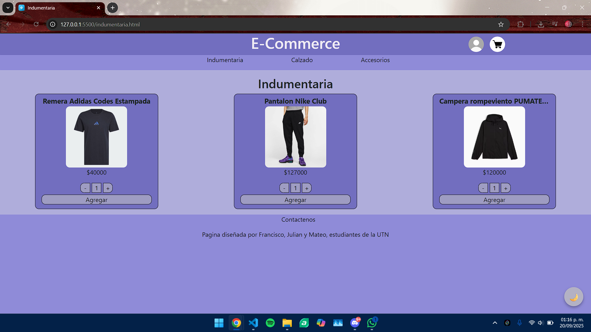
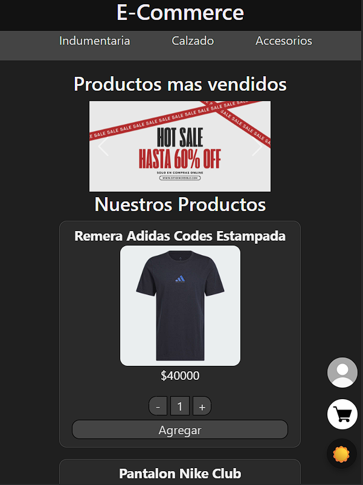

Integrantes del Proyecto
Julian Leites
Francisco Aguilar
Mateo Pereyra

Descripción del proyecto
Este proyecto es una tienda online desarrollada con HTML, CSS, JavaScript y Bootstrap, que simula un e-commerce sencillo con funcionalidades básicas.
El objetivo es simular el funcionamiento básico de una tienda online, practicar el manejo del DOM, eventos en JavaScript, validaciones y el uso de almacenamiento local, además de aplicar conceptos de diseño web responsive.
Tecnologías usadas
HTML
CSS
Bootstrap 
JavaScript
LocalStorage para persistencia de datos

Instrucciones para ejecutarlo
1- Clonar este repositorio o descargarlo en tu PC y abrir la carpeta con visual.  https://github.com/JulianLeites/TP_Programacion2.git
2- Abrir el archivo index.html en tu navegador.
3- Navegar por el catálogo, secciones, probar el carrito de compras y el sistema de inicio de sesión.
4- Para entrar a la pagina de contacto se debe ingresar desde el Footer

FUNCIONALIDADES IMPLEMENTADAS y EXTRAS

-Catálogo de productos con 9 artículos (nombre, precio e imagen).

-Carrusel con ofertas.

-Carrito de compras:
Agregar productos con cantidad seleccionada.
Guardado en localStorage (persistencia al recargar).
Eliminar productos del carrito.
-Modo oscuro con persistencia en el almacenamiento local.

-Secciones de navegación:
Indumentaria 
Calzado 
Accesorios
Contactenos 
-Páginas individuales de producto con más detalle.

Sistema de registro e inicio de sesión:
Formulario de registro con validaciones de nombre, usuario, email y contraseña.
Formulario de inicio de sesión que verifica los datos almacenados.
Persistencia de usuarios con localStorage.